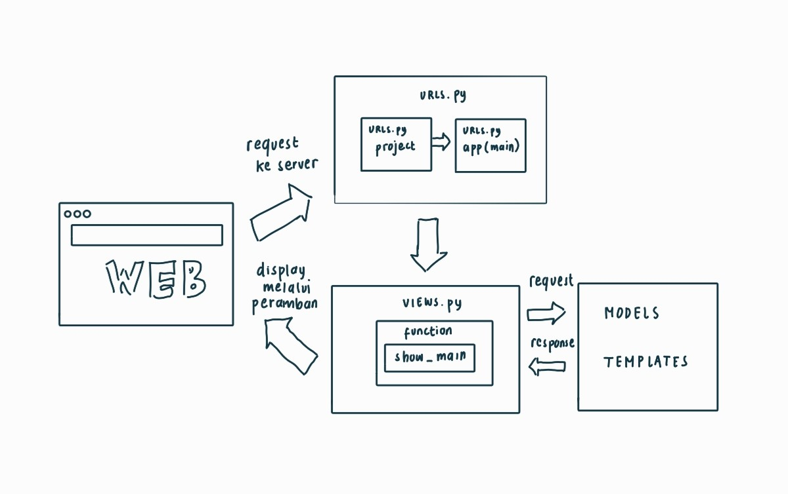
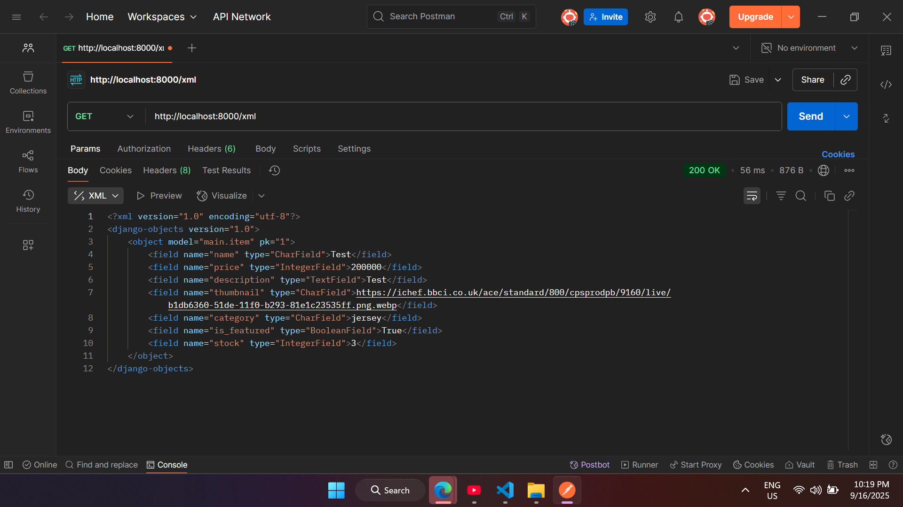
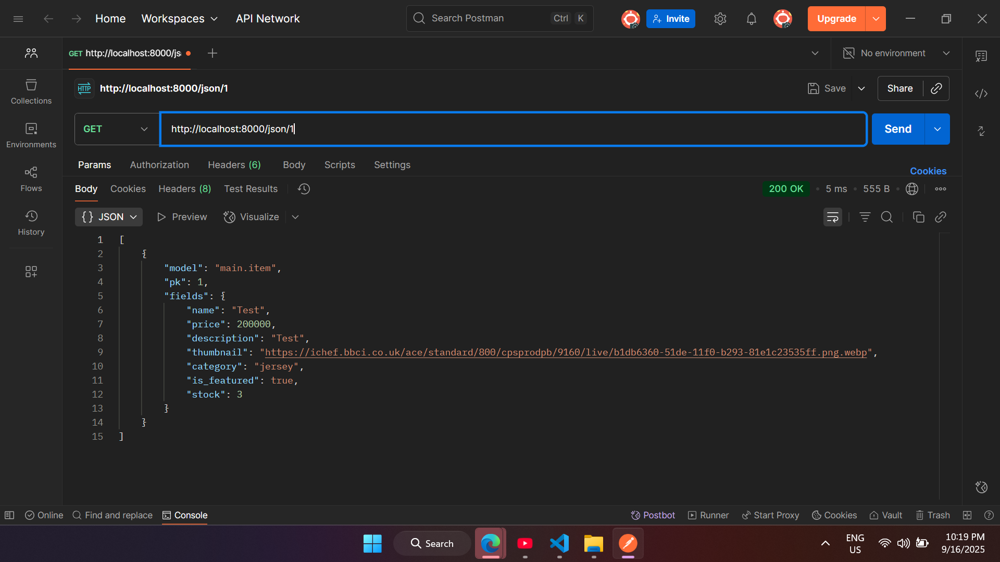
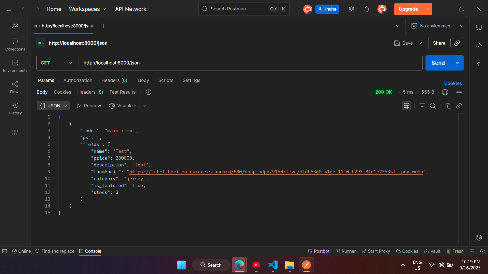

Tautan : https://matthew-wijaya-kickoff.pbp.cs.ui.ac.id/

--------------TUGAS 2--------------------

(1)
Dalam mengerjakan checklist yang diberikan, saya mulai dengan melakukan setup pada aplikasi terlebih dahulu, hal ini saya lakukan dengan membuat repository, membuat projek Django baru, dan melakukan konfigurasi database, server, dan lainnya. Lalu, saya lanjutkan dengan menjalankan routing pada bagian proyek agar aplikasi "main" bisa dijalankan. Saya melakukan hal ini dengan menambahkan include() di dalam file urls.py main project, sehingga setiap request yang masuk bisa diarahkan ke main nantinya. Selanjutnya. saya membuat sebuah model di dalam models.py bernama Product sesuai dengan atribut yang diminta dan menambahkan atribut yang saya rasa perlu yaitu "stock". Setelah itu, saya melakukan makemigrations dan migrate supaya database dapat dikonversi sesuai dengan model yang saya buat sebelumnya. 

Lalu, saya membuat function show_main di views.py. Hal ini dilakukan supaya nama aplikasi saya, nama saya, dan kelas saya dapat di display di website. Agar function bisa diakses, saya menambahkan path di urls.py agar dapat diakses dan ditampilkan ke pengguna dalam bentuk HTML. Saya melakukan push ke Github dan PWS setelah semuanya selesai dilakukan

(2)

Alur request client ke web berbasis Django dapat dijelaskan di dalam bagan di atas. Pertama, pengguna mengirim request ke server ketika mereka ingin meakses sebuah web, kemudian request diproses oleh urls.py agar dapat mengeksekusi fungsi sesuai yang dituju, kemudian dipass ke view yang akan menjalankan logic programnya. Jika program butuh akses model, views.py akan mengirim request untuk meminta kebutuhannya. Hasil yang sudah diproses akan diisi ke dalam template HTML dan dikirim kembali ke peramban web milik client. Pada dasarnya, urls.py berperan memetakan jalur, views.py mengolah function-function yang ada, dan models.py memenuhi request dari views.py sesuai kebutuhan, hasil yang dikirim berupa HTML yang dapat dilihat oleh client.

(3)
settings.py berperan untuk konfigurasi proyek Django. File tersebut digunakan untuk mendelegasikan aplikasi apa saja yang aktif, konfigurasi database, mendefinisikan letak template, dan keamanan serta autentikasi, termasuk mereka hosts yang diberikan izin untuk mengakses.

(4)
Migrasi database pada Django dilakukan dengan mengeksekusi makemigrations dan migrate. Proses ini harus dilakukan setiap kali ada perubahan pada model untuk mengupdate berkas migration yang nantinya akan mengubah struktur database sesuai yang ada di dalam models, sehingga keduanya tetap sinkron. Database jadi bisa terus diupdate seiring dengan development aplikasi berjalan, tidak perlu diubah lagi secara manual.

(5)
Django dijadikan sebagai framework pertama karena isinya lengkap dan terstruktur dari bawaan. Salah satu alasan yang mendasar adalah karena API yang dibuat oleh Django dapat menghubungkan antara piranti web dan juga aplikasi mobile melalui flutter. Selain itu, Django juga bersifat open source, cepat, dan aman. Berbagai template juga tersedia sehingga pemula, seperti saya dan mahasiswa lainnya, bisa fokus ke dalam memahami web development tanpa berkutat di bagian yang menyulitkan karena membangun dari 0.

(6)
SAaya rasa tutorialnya sudah dipresentasikan dengan baik, yang saya suka dari tutorial di mata kuliah ini adalah bahwa file-file yang harus dibuka untuk diedit diberitahukan di bagian awal dari instruksi, sehingga tidak ada kekeliruan yang tidak perlu akibat kesalahan file karena nama yang serupa. Namun, sebagai saran, jika ada warning, tolong dipastikan tidak ada pemisah antara warning dengan instruksinya, karena saya ingat kemarin saya sempat mengeksekusi suatu perintah yang seharusnya ada titik di belakangnya, tapi warningnya terletak lebih ke bawah sehingga tidak terbaca. Selain itu, semuanya sudah sangat baik. Terima kasih!

--------------TUGAS 3--------------------

(1)
Data delivery diperlukan dalam implementasi sebuah platform karena pada dasarnya platform tidak mungkin berdiri sendiri tanpa adanya interaksi dengan komponen lain. Sebagai contoh, semisal kita ingin mendisplay html yang sudah dirender oleh views sesuai request user di halaman browser pengguna, maka harus ada data delivery yang dilakukan dari server django kita ke browser pengguna agar dapat ditampilkan. Selain itu, seperti pada implementasi form di tugas ini, setelah pengguna menambahkan produk di halaman form, maka akan terjadi data delivery yang mengupdate xml yang akan didisplay ke user, karena itulah data delivery dibutuhkan.

(2)
Menurut saya, JSON lebih baik. Melihat kode yang ditampilkan, JSON dapat lebih mudah dibaca dan dipahami dibandingkan XML. XML sendiri memiliki lebih banyak syntax-syntax yang bermanfaat bagi eksekusi program tapi terasa redundan bagi pembaca dan penulis code. Hal ini mungkin menjadi salah satu alasan mengapa JSON bisa lebih populer dibandingkan XML. JSON juga dapat lebih banyak digunakan di aplikasi web atau mobile dan struktur data yang lebih sederhana.

(3)
Method is_valid() pada form Django berfungsi sebagai pemeriksaan akhir sebelum dilakukan save. Pada contoh, jika kita tinjau dari kode berikut di views.py
    if form.is_valid() and request.method == "POST":
        form.save()
        return redirect('main:show_main')
Pada fungsi tersebut, is_valid berfungsi untuk memeriksa apakah data yang diinput sudah benar. Jika kita bedah lebih dalam, is_valid akan mengecek bahwa apakah data tidak None dan files tidak None. Selain itu, akan dicek juga apakah file memiliki error atau tidak. Dalam konteks di aplikasi ini, melalui is_valid, program akan mencek apakah data yang ingin didaftarkan sudah sesuai dengan requirements dari moidels dan forms.

(4)
csrf_token berguna untuk melindungi aplikasi dari cross site request forgery, ini berupa serangan yang dilakukan dengan memalsukan request dari browser user yang sudah berhasil login kedalam aplikasi. Jika tidak ada csrf_token, skenario yang dapat terjadi adalah bahwa hacker dapat mengakses tab lain di browser yang telah login dengan kredensial user, ia akan mengirim request ke web dan mengubah alur informasinya dari ke browser user menjadi ke channel miliknya. Dalam kode, csrf token digunakan dalam kode di add_item.html. Cara kerjanya adalah Django menghasilkan sebuah token rahasia yang disimpan di dua tempat, sebagai cookie dan di hasil render HTML. Ketika user mengisi form dan mengklik Add Item, browser akan mengirimkan request ke server. Setelah itu, sebelum Django memproses data ke view, token akan dicocokan terlebih dahulu sebelum diproses untuk mencegah adanya pengambilan data secara ilegal.

(5)
Dalam Tugas 3 ini, saya melakukan modifikasi sebagai berikut: Saya mengkonfigurasi .html sehingga terdapat template base yang nantinya digunakan untuk semua berkas html yang ada, termasuk di dalamnya adalah main.html. Selain itu, saya membuat sebuah model form untuk menyimpan data menjadi sebuah objek. 

Setelah itu, saya juga membuat dua fungsi baru, yaitu add item dan show item. Add item dibuat untuk menghasilkan form yang menambah data item ketika ada item yang disubmit, sedangkan show item digunakan untuk mengambil item berdasarkan primary key yang adalah idnya. Saya juga menambahkan bagian content di dalam main.html untuk menampilkan data items dan tombol Add Items, serta memodifikasi templates sebagai media menampilkan items dan details. 

Terakhir, saya menambahkan 4 fungsi baru pada views.py yaitu untuk mengembalikan request dalam bentuk xml, json, dan juga variasi fungsi untuk memfilternya berdasarkan id. Kemudian, saya melakukan routing melalui urls.py dan mempush semuanya ke github dan PWS.

(6)
Tidak, semuanya sudah bagus

POSTMAN_XML: 

POSTMAN_JSON: 

POSTMAN_XML_BYID: 

POSTMAN_JSON_BYID: 

---
## Tugas Individu 4

# (1)
Django AuthenticationForm berguna untuk meningkatkan keamanan dari website dengan menambahkan autentikasi sekaligus mensimplifikasi proses login dari user. Form ini menyediakan dua field secara langsung yaitu username dan password. Dalam Form ini terdapat aspek keamanan yang sudah dikelola secara built-in dari Django sendiri, termasuk bagian utama yaitu memeriksa kredensial pengguna, tanpa perlu konfigurasi tambahan. Selain itu, Autentikasi juga dapat diimplementasika melalui backend dari web sehingga pemberian otorisasi juga dapat dilakukan melalui backend.

Namun, kekurangan yang dimiliki adalah bahwa Form ini masih bersifat sangat mendasar dan terbatas di field username dan password, jika ingin ada opsi lain untuk masuk ke dalam web, maka harus dikonfigurasikan sendiri. 

# (2)
Perbedaan antara autentikasi dan otorisasi menurut saya bersifat berkelanjutan, autentikasi dilakukan untuk memverifikasi kredensial dari user. Tujuan utamanya adalah untuk memastikan pengguna benar-benar mereka yang memiliki akun dan menolak apabila ada percobaan akses dengan kredensial yang tidak sesuai melampaui batas tertentu. Di sisi lain, otorisasi adalah pemberian akses bagi user yang telah berhasil melalui proses autentikasi sesuai dengan masing-masing role yang mereka miliki. Apakah mereka hanya berperan sebagai viewers atau mereka dapat mengedit konten-konten yang ada di dalam website akan disesuikan di proses otorisasi. Perbedaan hak ases yang dimiliki oleh user yang belum login dan yang sudah login juga dibedakan setelah melalui proses otorisasi.

# (3)
Cookies dapat meningkatkan user experience dari seorang pengguna web karena menyimpan informasi seperti login credentials dan juga preferensi ketika user kembali mengakses website tersebut melalui penyimpanan di dalam browser. Hal ini memudahkan pembuat website dalam mengetahui apa minat user sehingga tampilan web dapat disesuaikan dengan apa yang disukai oleh user. Selain itu, cookies relatif lebih mudah diakses karena disimpan di browser milik user. 

Kekurangan yang dimiliki cookies adalah bahwa bagaimana data dapat dihapus oleh pengguna dan juga memiliki resiko keamanan apabila digunakan untuk menyimpan data sensitif karena sifatnya yang tidak langsung dibuang ketika browser dimatikan.

Di sisi lain, session adalah data user yang disimpan di server, membuatnya lebih aman dan ideal untuk menyimpan informasi yang sementara atau yang bersifat sensitif. Selain itu, yang membuatnya lebih aman dari cookies juga adalah bahwa session akan diterminate secara otomatis setelah usernya inaktif atau memang diprogram untuk dihancurkan, posisinya yang berada di server juga membuatnya tidak terekspos langsung ke pengguna. Hal ini membuatnya akan sulit untuk digali oleh peretas karena akan langsung hilang dan tidak bertahan di browser seperti informasi yang disimpan di dalam cookies. Kekurangan dari session adalah karena alokasi memorinya yang terpusat di server dan dapat menjadi beban yang menumpuk bagi server apabila aktif dalam jumlah banyak.

# (4)
Aman apabila juga ada aksi kooperatif dari user, peretasan yang dilakukan melalui informasi yang disimpan di dalam web umumnya dilakukan ketika user mengakses suatu tautan yang dapat langsung mengeksekusi script yang ditetapkan oleh peretas. Selain itu, bisa terjadi manipulasi data yang berada di dalam cookies untuk menredirect informasi dari website agar informasi dikirimkan kepada peretas. 

Penanganan melalui Django dapat dilakukan dengan adanya token CSRF yang dimiliki oleh kedua belah pihak yang berinteraksi yaitu client dan server. Hal ini dapat meminimalisir akses yang tidak terautorisasi apabila CSRF token yang dimiliki tidak sesuai. Selain itu, Django mayoritas menggunakan session dalam implementasinya, dan cookies hanya sebagai perantara berupa ID yang terenkripsi dan sulit diretas, hal ini dapat mencegah terjadinya manipulasi.

# (5)
Dalamm menyelesaikan tugas ini, pertama saya membuat tiga fungsi view di views.py untuk register, login, dan logout. Fungsi register dibuat menggunakan sistem bawaan Django yaitu UserCreationForm untuk menyimpan user baru. Selain itu, fungsi login akan menggunakan authenticationform untuk memeriksa kredensial dari user. Logout user juga menggunakan sistem bawaan dari Django untuk meng-end session. Setiap fungsi kemudian dipetakan ke urls.py dan template HTML sederhana juga ditambahkan untuk page regis dan login.

Lalu, saya menghubungkan data dengan user dengan memodifikasi models.py. Pada Product saya menambahkan sebauh field store yang melink dengan User. Ini akan memetakan pengguna dengan produk yang mereka tambahkan, kemudian saya lakukan makemigrations dan migrate untuk mengkonfigurasi database. Setelah itu, saya melakukan percobaan pembuatan akun dan penambahan produk oleh masing-masing user.

Terakhir, saya memodifikasi views.py untuk menampilkan last session dan cookie. Saya mengambil informasi pengguna dari request.user dan mendisplaynya melalui template. Saya atur cookie last login session dengan menambahkannya di function login_user setelah berhasil diautentikasi. cookie akan dihapus apabila pengguna logout dari akun milik mereka.

---
## Tugas Individu 5

# (1)

Ketika sbbuah HTML memiliki beberapa style yang didefinisikan sebagai selector CSS, browser akan memprioritaskannya berdasarkan prioritas tertinggi yang ada, urutannya adalah,
- Inline : Atribut yang ditulis langsung di dalam tag HTML seperti <h1 ... </h1>
- ID Selector : Style yang menargetkan sebuah id unik elemen seperti warna dengan hex code tertentu
- Class : Style yang menargetkan elemen berdasarkan class, state khusus, atau atribut.
- Element Selector : Style yang menargetkan semua elemen dengan tag HTML yang sama
- Default browser : Style bawaan browser

# (2)
Design yang responsive dari web ketika dibuka di berbagai platform adalah bagian dari UX yang menciptakan ketertarikan dari pengguna. Sebelum saya memodifikasi kode, navbar saya memiliki suatu masalah yang terjadi ketika ukuran window dikecilkan adalah bahwa tombol add item menghilang dan tidak dapat diakses. Ketika hal ini terjadi, pengguna dapat meninggalkan website dengan kesan yang buruk karena fitur yang tidak dapat mereka akses, termasuk seperti kesulitan membaca teks, menekan tombol, menavigasi situs, dsb. yang membuat mereka dengan cepat keluar dari situs web tersebut.

# (3)

Margin, Border, dan Padding adalah bagian dari CSS Box Model yang membedakan bagaimana wrapping setiap elemen HTML
- Padding adalah ruang transparan dalam border, gunanya adalah untuk memberikan jarak antara satu konten dengan konten yang lain untuk mempermudah user dalam membedakan masing-masing elemen dan memiliki experience serta memhami hierarchy dengan lebih baik.
- Border adalah garis yang mengelilingi padding dan konten, bisa berupa garis biasa, titik-titik, berwarna, dsb.
- Margin adalah ruang transparan DI LUAR border, sama seperti padding tapi terletak di luar dan biasanya berlaku secara global di satu page untuk menciptakan area yang tidak developer inginkan user untuk ditempati elemen.

# (4)

Flexbox dan Grid adalah dua sistem layout di CSS untuk mengatur elemen di suatu page. 
- Flexbox adalah flexible box layout, yang digunakan untuk design layout satu dimensi, sebagai row atau collumn. Dengan menggunakan flexbox, jarak antar elemen bisa diseragamkan sehingga terlihat teratur dengan jarak yang sama antara satu dengan yang lainnya. Diimplementaskan dengan display: flex dan digunakan dalam tombol edit dan delete di card item.
- Grid Layout digunakan untuk layout dua dimensi, mendesign baris dan kolom secara bersamaan membaginya menajdi blok-blok tertentu. Ini ideal untuk penempatan elemen secara umum, baik di home page, gallery atau sebagainya yang mempunyai banyak repetisi, butuh kerapihan, dan cenderung kompleks. Di program ini digunakan dalam mendisplay card_ide. 

# (5)

Untuk mengimplementasikan tugas minggu ini, lebih berfokus ke aspek design dan juga UI dari website itu sendiri. Saya melakukannya dengan mengintegrasi Tailwind CSS pertamanya. Kita memilih Tailwind untuk styling karena adanya berbagai utility yang bisa digunakan untuk mempercepat desain. Tailwind ditambahkan di base.html yang diextend ke semua halaman.

Kemudian, saya mendesain sebuah navbar melalui navbar.html. Navbar saya desain sebagai sidebar vertikal yang terletak di sisi kiri. Saya memastikan sidebar tersebut responsif setelah melakukan pengetesan. Saat di layar besar, sidebarnya bersifat statis di sebelah kiri, dan ketika di layar kecil, sidebarnya dapat dibuka dengan menekan button hamburger yang membuatnya responsif. 

Saya juga melakukan styling di berbagai halaman lain mulai dari main.html. Saya mencoba bereksperimen dengan membuat desing di halaman utama menjadi berbeda dan tidak begitu mirip dengan tutorial. Kemudian, untuk card item , saya juga merancang card tersebut untuk lebih menghighlight harga karena kita berperan sebagai toko. Saya juga menghapus tombol read more dan memindahkannya ke card itu sendiri secara utuh. 

Terakhir, saya mengganti warna elemen-elemen di keseluruhan website dari hijau menjadi merah yang beraksen untuk memberikan keunikan dari website.

---
## Tugas Individu 6

# (1)
Perbedaan synchronous dan asynchronous request terletak di bagaimana mereka merespon terhadap suatu request. Synchronous request mencegah browser untuk mengeksekusi kode berikutnya sampai server memberikan respon. Jika request yang dilakukan menghasilkan respon, maka bagian kode selanjutnya akan dieksekusi, dan kita tidak bisa mengirim request baru jika belum mendapatkan jawaban dari request yang sebelumnya. Dalam ajax request, synchronous dibuat dengan async parameter yang diset ke false. Sedangkan, asynchronous request tidak mencegah browser untuk mengeksekusi perintah berikutnya sebelum server merespon. Jadi, browser tidak akan menahan eksekusi kode tapi langsung mengeksekusi kode sampai akhir. Akibat sistemnya tersebut, browser bisa mengirim beberapa request di saat yang bersamaan, parameter yang digunakan adalah async yang diset ke true.

# (2)
Flow Ajax : User mentrigger suatu aksi -> JavaScript meregister aksi tersebut dan membuat XMLHttpRequest -> Request dikirimakn ke server -> Request diproses di server -> JavaScript menerima respon dan mengupdate webpage

Dalam Django, Ajax request dikirimkan oleh bagian dari frontend ke urls untuk dialirkan juga ke view. Request yang diberikan dapat berupa GET atu POST. Django kemudian memproses requestnya dan melakukan eksekusi operasi yang diinginkan, dan mengirimkan respon (umumnya dalam bentuk JSON). Kemudian, frontend dari web akan menghandle informasi yang dikirimkan tersebut dan memperbaharui website secara dinamis tanpa mereload keseluruhan pagenya.

# (3)
Peran Ajax dalam Django terletak di sifatnya yang bisa menjadi asynchronous. Di sistem web umumnya saat ini, terdapat beberapa fitur yang membutuhkan berjalan secara asynchronous sehingga interaksi dapat terjadi secara real-time tanpa harus menunggu adanya respon dan mereload page. Ajax memungkinkan sebuah web untuk diperbaharui secara berkala dan asynchronous dengan bertukar sedikit demi sedikit data dengan server di belakang layar. Perbedaannya dengan render pada umumnya terlihat di sifatnya ini. Pada render, kita mengirimkan keseluruhan data setelah suatu block code selesai diproses, kemudian menunggu respon dari server untuk mengembalikan hasil renderan. Di sisi lain, dengan Ajax, kita bisa melakukan update ini secara realtime dan mereload sebagian demi sebagian part dari web yang memungkinkan untuk tidak melakukan reload suatu web secara keseluruhan. Hal ini juga akan mengimprove website dari sisi user experience atau pengalaman penggunanya karena pengguna bisa melihat konsekuensi dari aksi yang mereka lakukan secara langsung tanpa perlu mereload atau menunggu respon dari server.

# (4)
Ajax dapat menghasilkan ancaman di aspek keamanan karena terdapat beberapa celah yang dapat dimanfaatkan peretas untuk mencari vurnerability dari web kita. Beberapa kelemahan itu meliputi,

Cross Site Scripting, yang terjadi saat pengguna menginject scripts ke respons dari Ajax. Ketika dieksekusi di browser, peretas dapat mengambil informasi sensitif yang dikembalikan dan memberikan mereka akses untuk melakukan hal yang merugikan user. Hal yang dapat dilakukan untuk mengatasi hal ini adalah melakukan validasi input dan men"sanitize" konten sebelum memprosesnya. Selain itu, data yang diberikan oleh user juag dipastikan berupa text, bukan kode yang dapat dieksekusi.

Cross Site Request Forgery, seperti yang sudah dibahas di tugas-tugas sebelumnya adalah ketika peretas mencoba menggunakan browser milik user, yang di mana session terautentikasi dari user masih "menyangkut" di browser tersebut, untuk melakukan hal yang tidak diinginkan dan dapat merugikan user. Dari problem ini, kita bisa menggenerate random token untuk setiap request dan memastikan abhwa request Ajax diberikan dari domain yang sama dengan yang meangkses.

Insecure Direct Object References, yang diakibatkan karena request Ajax melibatkan mengakses resources dari server menggunakan identifier. Jika identifiernya terkuak, maka peretas dapat memanipulasinya untuk memberikan mereka akses. Cara pencegahan yang dapat dilakukan adalah dengan menghindari mengekspos data sensitif melalui respon Ajax (validasi di sisi server) dan memvalidasi siapa yang mengakses suatu resource tertentu. 

# (5)

Ajax dapat mengimprove user experience karena sifatnya yang dapat mengambil, mengirim, dan mengupdate data secara dinamis. Website menjadi lebih responsive dan interaktif tanpa perlu adanya reload page. Ajax digunakan di berbagai jenis website seperti social media, yang memungkinkannya dapat meload page baru dan komen secara dinamis (tanpa reload), aplikasi cuaca, yang memungkinkan untuk mengetahui data cuaca saat ini dan mendisplaynya, e-commerce website (seperti web ini), yang memungkinkannya untuk melakukan filtering, mengupdate keranjang belanja, dan memproses pesanan tanpa reload.

Secara lebih jelas, operasi asynchronous memungkinkan website dapat mengeksekusi perintah tanpa memblock apa yang sedang ditampilkan, memastikan interfacenya tetap responsif saat ada yang sedang dieksekusi di background. Saat web smooth dan responsif, user akan cenderung lebih tertarik untuk tetap berada di dalam web itu, dan juga untuk kembali ke dalam web tersebut. Jika user harus menunggu suatu proses selesai untuk dapat berinteraksi lagi dengan aplikasi, mereka akan cenderung meninggalkan web dengan cepat. Dengan kecil atau tidak adanya gap di mana user harus menunggu, atensi mereka bisa dikelola dan dipertahankan dengan baik karena websitenya terkesan lebih cepat dan juga responsive. 