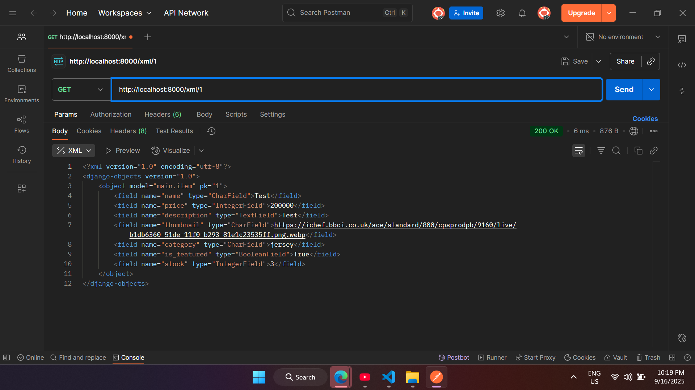

Tautan : https://matthew-wijaya-kickoff.pbp.cs.ui.ac.id/

--------------TUGAS 2--------------------

(1)
Dalam mengerjakan checklist yang diberikan, saya mulai dengan melakukan setup pada aplikasi terlebih dahulu, hal ini saya lakukan dengan membuat repository, membuat projek Django baru, dan melakukan konfigurasi database, server, dan lainnya. Lalu, saya lanjutkan dengan menjalankan routing pada bagian proyek agar aplikasi "main" bisa dijalankan. Saya melakukan hal ini dengan menambahkan include() di dalam file urls.py main project, sehingga setiap request yang masuk bisa diarahkan ke main nantinya. Selanjutnya. saya membuat sebuah model di dalam models.py bernama Product sesuai dengan atribut yang diminta dan menambahkan atribut yang saya rasa perlu yaitu "stock". Setelah itu, saya melakukan makemigrations dan migrate supaya database dapat dikonversi sesuai dengan model yang saya buat sebelumnya. 

Lalu, saya membuat function show_main di views.py. Hal ini dilakukan supaya nama aplikasi saya, nama saya, dan kelas saya dapat di display di website. Agar function bisa diakses, saya menambahkan path di urls.py agar dapat diakses dan ditampilkan ke pengguna dalam bentuk HTML. Saya melakukan push ke Github dan PWS setelah semuanya selesai dilakukan

(2)

Alur request client ke web berbasis Django dapat dijelaskan di dalam bagan di atas. Pertama, pengguna mengirim request ke server ketika mereka ingin meakses sebuah web, kemudian request diproses oleh urls.py agar dapat mengeksekusi fungsi sesuai yang dituju, kemudian dipass ke view yang akan menjalankan logic programnya. Jika program butuh akses model, views.py akan mengirim request untuk meminta kebutuhannya. Hasil yang sudah diproses akan diisi ke dalam template HTML dan dikirim kembali ke peramban web milik client. Pada dasarnya, urls.py berperan memetakan jalur, views.py mengolah function-function yang ada, dan models.py memenuhi request dari views.py sesuai kebutuhan, hasil yang dikirim berupa HTML yang dapat dilihat oleh client.

(3)
settings.py berperan untuk konfigurasi proyek Django. File tersebut digunakan untuk mendelegasikan aplikasi apa saja yang aktif, konfigurasi database, mendefinisikan letak template, dan keamanan serta autentikasi, termasuk mereka hosts yang diberikan izin untuk mengakses.

(4)
Migrasi database pada Django dilakukan dengan mengeksekusi makemigrations dan migrate. Proses ini harus dilakukan setiap kali ada perubahan pada model untuk mengupdate berkas migration yang nantinya akan mengubah struktur database sesuai yang ada di dalam models, sehingga keduanya tetap sinkron. Database jadi bisa terus diupdate seiring dengan development aplikasi berjalan, tidak perlu diubah lagi secara manual.

(5)
Django dijadikan sebagai framework pertama karena isinya lengkap dan terstruktur dari bawaan. Salah satu alasan yang mendasar adalah karena API yang dibuat oleh Django dapat menghubungkan antara piranti web dan juga aplikasi mobile melalui flutter. Selain itu, Django juga bersifat open source, cepat, dan aman. Berbagai template juga tersedia sehingga pemula, seperti saya dan mahasiswa lainnya, bisa fokus ke dalam memahami web development tanpa berkutat di bagian yang menyulitkan karena membangun dari 0.

(6)
SAaya rasa tutorialnya sudah dipresentasikan dengan baik, yang saya suka dari tutorial di mata kuliah ini adalah bahwa file-file yang harus dibuka untuk diedit diberitahukan di bagian awal dari instruksi, sehingga tidak ada kekeliruan yang tidak perlu akibat kesalahan file karena nama yang serupa. Namun, sebagai saran, jika ada warning, tolong dipastikan tidak ada pemisah antara warning dengan instruksinya, karena saya ingat kemarin saya sempat mengeksekusi suatu perintah yang seharusnya ada titik di belakangnya, tapi warningnya terletak lebih ke bawah sehingga tidak terbaca. Selain itu, semuanya sudah sangat baik. Terima kasih!

--------------TUGAS 3--------------------

(1)
Data delivery diperlukan dalam implementasi sebuah platform karena pada dasarnya platform tidak mungkin berdiri sendiri tanpa adanya interaksi dengan komponen lain. Sebagai contoh, semisal kita ingin mendisplay html yang sudah dirender oleh views sesuai request user di halaman browser pengguna, maka harus ada data delivery yang dilakukan dari server django kita ke browser pengguna agar dapat ditampilkan. Selain itu, seperti pada implementasi form di tugas ini, setelah pengguna menambahkan produk di halaman form, maka akan terjadi data delivery yang mengupdate xml yang akan didisplay ke user, karena itulah data delivery dibutuhkan.

(2)
Menurut saya, JSON lebih baik. Melihat kode yang ditampilkan, JSON dapat lebih mudah dibaca dan dipahami dibandingkan XML. XML sendiri memiliki lebih banyak syntax-syntax yang bermanfaat bagi eksekusi program tapi terasa redundan bagi pembaca dan penulis code. Hal ini mungkin menjadi salah satu alasan mengapa JSON bisa lebih populer dibandingkan XML. JSON juga dapat lebih banyak digunakan di aplikasi web atau mobile dan struktur data yang lebih sederhana.

(3)
Method is_valid() pada form Django berfungsi sebagai pemeriksaan akhir sebelum dilakukan save. Pada contoh, jika kita tinjau dari kode berikut di views.py
    if form.is_valid() and request.method == "POST":
        form.save()
        return redirect('main:show_main')
Pada fungsi tersebut, is_valid berfungsi untuk memeriksa apakah data yang diinput sudah benar. Jika kita bedah lebih dalam, is_valid akan mengecek bahwa apakah data tidak None dan files tidak None. Selain itu, akan dicek juga apakah file memiliki error atau tidak. Dalam konteks di aplikasi ini, melalui is_valid, program akan mencek apakah data yang ingin didaftarkan sudah sesuai dengan requirements dari moidels dan forms.

(4)
csrf_token berguna untuk melindungi aplikasi dari cross site request forgery, ini berupa serangan yang dilakukan dengan memalsukan request dari browser user yang sudah berhasil login kedalam aplikasi. Jika tidak ada csrf_token, skenario yang dapat terjadi adalah bahwa hacker dapat mengakses tab lain di browser yang telah login dengan kredensial user, ia akan mengirim request ke web dan mengubah alur informasinya dari ke browser user menjadi ke channel miliknya. Dalam kode, csrf token digunakan dalam kode di add_item.html. Cara kerjanya adalah Django menghasilkan sebuah token rahasia yang disimpan di dua tempat, sebagai cookie dan di hasil render HTML. Ketika user mengisi form dan mengklik Add Item, browser akan mengirimkan request ke server. Setelah itu, sebelum Django memproses data ke view, token akan dicocokan terlebih dahulu sebelum diproses untuk mencegah adanya pengambilan data secara ilegal.

(5)
Dalam Tugas 3 ini, saya melakukan modifikasi sebagai berikut: Saya mengkonfigurasi .html sehingga terdapat template base yang nantinya digunakan untuk semua berkas html yang ada, termasuk di dalamnya adalah main.html. Selain itu, saya membuat sebuah model form untuk menyimpan data menjadi sebuah objek. 

Setelah itu, saya juga membuat dua fungsi baru, yaitu add item dan show item. Add item dibuat untuk menghasilkan form yang menambah data item ketika ada item yang disubmit, sedangkan show item digunakan untuk mengambil item berdasarkan primary key yang adalah idnya. Saya juga menambahkan bagian content di dalam main.html untuk menampilkan data items dan tombol Add Items, serta memodifikasi templates sebagai media menampilkan items dan details. 

Terakhir, saya menambahkan 4 fungsi baru pada views.py yaitu untuk mengembalikan request dalam bentuk xml, json, dan juga variasi fungsi untuk memfilternya berdasarkan id. Kemudian, saya melakukan routing melalui urls.py dan mempush semuanya ke github dan PWS.

(6)
Tidak, semuanya sudah bagus

POSTMAN_XML: 

POSTMAN_JSON: 

POSTMAN_XML_BYID: 

POSTMAN_JSON_BYID: 

